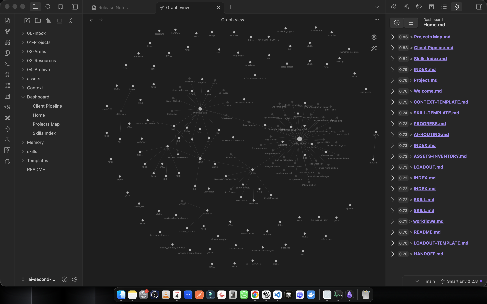
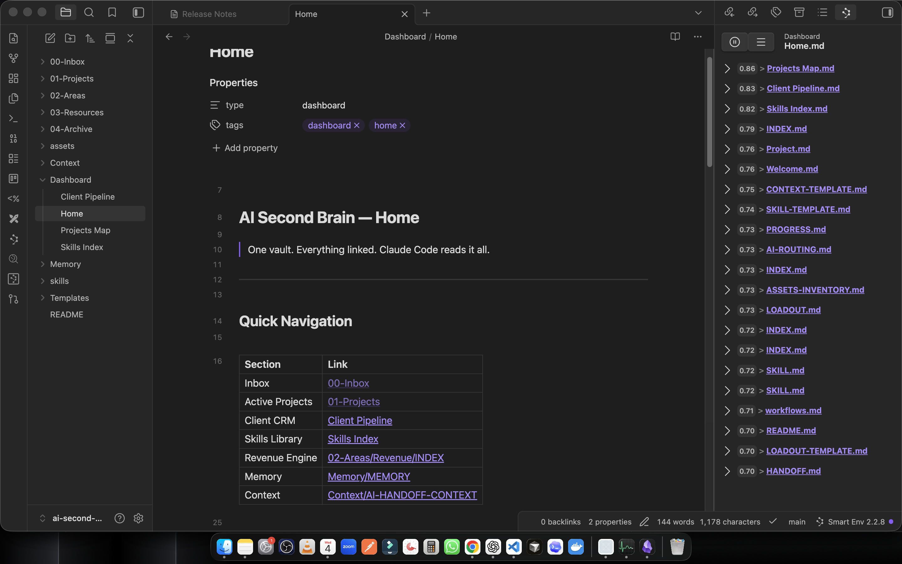

<p align="center">
  
</p>

<h1 align="center">AI Second Brain</h1>

<p align="center">
  <strong>Obsidian vault template for AI developers — connected to Claude Code via MCP</strong>
</p>

<p align="center">
  <a href="#-quick-start">Quick Start</a> •
  <a href="#-architecture">Architecture</a> •
  <a href="#-whats-included">What's Included</a> •
  <a href="#-claude-code-mcp">Claude Code MCP</a> •
  <a href="#-plugins">Plugins</a>
</p>

<p align="center">
  
  
  
  
  
</p>

---

## The Problem

Every AI developer / freelancer / solopreneur hits the same wall:

- **Projects scattered** across folders, Notion, Google Docs, random files
- **Client notes** in 5 different places — can't find that one conversation
- **Skills & automations** you built but forgot about
- **AI assistants** that start fresh every time — zero memory of your work
- **Context switching** between tools kills your flow

## The Solution

**One Obsidian vault. PARA structure. Connected to Claude Code via MCP.**

Your AI doesn't just answer questions — it **thinks with your entire knowledge base**.

Clone this template, fill it with your data, and your AI remembers everything.

---

## Quick Start

### 1. Clone & Open

```bash
git clone https://github.com/aiagentwithdhruv/obsidian-ai-vault.git
```

Open Obsidian → **Open folder as vault** → select the cloned folder.

### 2. Enable Plugins

Go to **Settings → Community Plugins → Turn on community plugins**

Install the recommended plugins listed in the [Plugins](#-plugins) section.

### 3. Connect Claude Code (MCP)

Install the Obsidian MCP server:
```bash
npm install -g obsidian-mcp
```

Add to your project settings (`~/.claude/projects/<your-project>/settings.json`):
```json
{
  "mcpServers": {
    "ObsidianVault": {
      "command": "obsidian-mcp",
      "args": ["/path/to/your/obsidian-ai-vault"]
    }
  }
}
```

### 4. Install Official Obsidian Skills (Optional)

```bash
npx skills add kepano/obsidian-skills -y
```

This installs 5 skills by the CEO of Obsidian — teaches Claude Code how to properly read/write Obsidian files.

### 5. Start Building

- Open **Dashboard/Home.md** — your command center
- Use templates to create clients, projects, daily notes
- Claude Code can now search, create, and update notes in your vault

---

## Architecture

```
obsidian-ai-vault/
│
├── 00-Inbox/                    # Quick capture — dump ideas here
├── 01-Projects/                 # Active projects with deadlines
├── 02-Areas/                    # Ongoing responsibilities
│   ├── Clients/                 # Client CRM (one note per client)
│   ├── Revenue/                 # Revenue tracking & pipeline
│   ├── Content/                 # Content calendar & ideas
│   └── Freelancing/             # Upwork, Fiverr, LinkedIn
├── 03-Resources/                # Reference material
│   ├── Skills/                  # Automation skills & patterns
│   ├── Agents/                  # AI sub-agents
│   ├── Workflows/               # n8n / automation docs
│   └── Research/                # Deep research notes
├── 04-Archive/                  # Completed / inactive
├── Context/                     # AI handoff context (CLAUDE.md, etc.)
├── Memory/                      # Persistent AI memory files
├── Templates/                   # 6 note templates
├── Dashboard/                   # 4 Dataview dashboards
└── .obsidian/                   # Obsidian config
```

This follows the **PARA method** (Projects, Areas, Resources, Archive) by Tiago Forte — the most proven system for organizing knowledge.

---

## What's Included

### 6 Templates

| Template | Purpose | Key Fields |
|----------|---------|------------|
| **Client** | CRM entry per client | status, channel, value, contacts |
| **Project** | Track active projects | status, priority, deadline, github |
| **Daily Note** | Daily standup / journal | tasks, wins, revenue, tomorrow |
| **Skill** | Document automation skills | inputs, outputs, steps, composable |
| **Meeting** | Meeting notes | attendees, agenda, action items |
| **Research** | Deep research sessions | question, findings, sources |

### 4 Dashboards (Dataview-powered)

| Dashboard | What It Shows |
|-----------|--------------|
| **Home** | Quick navigation, active clients, active projects, recent notes |
| **Client Pipeline** | CRM pipeline: leads → proposals → active → delivered |
| **Skills Index** | All skills by category with version |
| **Projects Map** | All projects with status, priority, deadlines |

### Folder Structure

| Folder | What Goes Here |
|--------|---------------|
| `00-Inbox` | Quick captures — process later |
| `01-Projects` | Time-bound goals (build X by Y date) |
| `02-Areas/Clients` | One note per client with frontmatter |
| `02-Areas/Revenue` | Revenue tracking, pricing, proposals |
| `03-Resources/Skills` | Reusable automation patterns |
| `Context` | AI context files (CLAUDE.md, brand, preferences) |
| `Memory` | Persistent AI memory across sessions |

---

## Claude Code MCP

The magic: Claude Code connects to your vault via MCP and can:

- **Search** across all notes, skills, and knowledge
- **Create** new client entries, project docs, meeting notes
- **Update** memory, context, and status fields
- **Navigate** the knowledge graph via backlinks
- **Query** using Dataview-style logic

### How It Works

```
┌─────────────────────────────────┐
│         OBSIDIAN VAULT          │
│  Skills • Clients • Projects    │
│  Memory • Context • Knowledge   │
│         ┌──────────┐            │
│         │  Graph   │            │
│         │  View    │            │
│         └────┬─────┘            │
└──────────────┼──────────────────┘
               │ MCP (obsidian-mcp)
               ▼
┌──────────────────────────────────┐
│         CLAUDE CODE              │
│  Reads • Writes • Searches      │
│  Reasons over your knowledge     │
└──────────────────────────────────┘
```

### Example Commands

Once connected, just ask Claude Code naturally:

- *"Search my vault for everything about lead generation"*
- *"Create a new client note for Acme Corp, $5000 project"*
- *"What skills do I have for email automation?"*
- *"Update my daily note with today's wins"*

---

## Plugins

### Must-Have (Pre-configured)

| Plugin | Purpose |
|--------|---------|
| **[Dataview](https://github.com/blacksmithgu/obsidian-dataview)** | Query vault like a database — powers all dashboards |
| **[Templater](https://github.com/SilentVoid13/Templater)** | Advanced templates with date math and logic |
| **[Tasks](https://obsidian-tasks-group.github.io/obsidian-tasks/)** | Task management with due dates and filters |
| **[Kanban](https://github.com/mgmeyers/obsidian-kanban)** | Visual pipeline boards for clients and projects |
| **[Calendar](https://github.com/liamcain/obsidian-calendar-plugin)** | Daily notes and content calendar |
| **[Obsidian Git](https://github.com/Vinzent03/obsidian-git)** | Auto-backup vault to GitHub |

### Recommended

| Plugin | Purpose |
|--------|---------|
| **[Smart Connections](https://github.com/brianpetro/obsidian-smart-connections)** | AI semantic search across your vault |
| **[Excalidraw](https://github.com/zsviczian/obsidian-excalidraw-plugin)** | Diagrams and system design inside notes |
| **[Commander](https://github.com/phibr0/obsidian-commander)** | Custom toolbar commands |
| **[Post Webhook](https://github.com/Masterb1234/obsidian-post-webhook)** | n8n / Make.com / Zapier integration |

---

## Screenshots

<p align="center">
  
  <br/><em>Home dashboard — Quick Navigation, Active Projects, Recent Notes</em>
</p>

<p align="center">
  
  <br/><em>Knowledge graph — everything connected through backlinks</em>
</p>

---

## Customization

### Adding Your Own Skills
1. Create a note in `03-Resources/Skills/your-skill-name/`
2. Use the **Skill** template
3. Document: inputs, outputs, steps, composable skills

### Setting Up CRM
1. Create client notes in `02-Areas/Clients/`
2. Use the **Client** template
3. Set frontmatter: `status: lead`, `channel: upwork`, `value: 2000`
4. View pipeline in **Dashboard/Client Pipeline.md**

### Daily Workflow
1. Create a daily note using the **Daily Note** template
2. Track: distribution done, tasks, wins, revenue, tomorrow's plan
3. Process inbox items into Projects/Areas/Resources/Archive

---

## Why Obsidian + Claude Code?

| Feature | Obsidian | Notion | Google Docs |
|---------|----------|--------|-------------|
| **Local-first** | Your files, your SSD | Cloud only | Cloud only |
| **AI-connected** | MCP to Claude Code | Limited AI | Gemini only |
| **Markdown** | Plain .md files | Proprietary | Proprietary |
| **Git-backed** | Full version history | No | No |
| **Plugin ecosystem** | 2700+ plugins | Limited | None |
| **Free** | Free (commercial $50) | $10/mo | Free-ish |
| **Offline** | Always works | Needs internet | Needs internet |
| **Knowledge graph** | Built-in graph view | No | No |

---

## Built By

**[Dhruv](https://github.com/aiagentwithdhruv)** — AI Developer building autonomous AI systems.

- [YouTube: AiwithDhruv](https://youtube.com/@aiwithdhruv)
- [LinkedIn](https://linkedin.com/in/aiwithdhruv)
- [Skills Library](https://github.com/aiagentwithdhruv/skills) (38 public skills)

---

<p align="center">
  <strong>Your AI doesn't just answer questions.<br/>It thinks with your entire knowledge base.</strong>
</p>

<p align="center">
  <a href="https://github.com/aiagentwithdhruv/obsidian-ai-vault/generate">
    
  </a>
</p>
